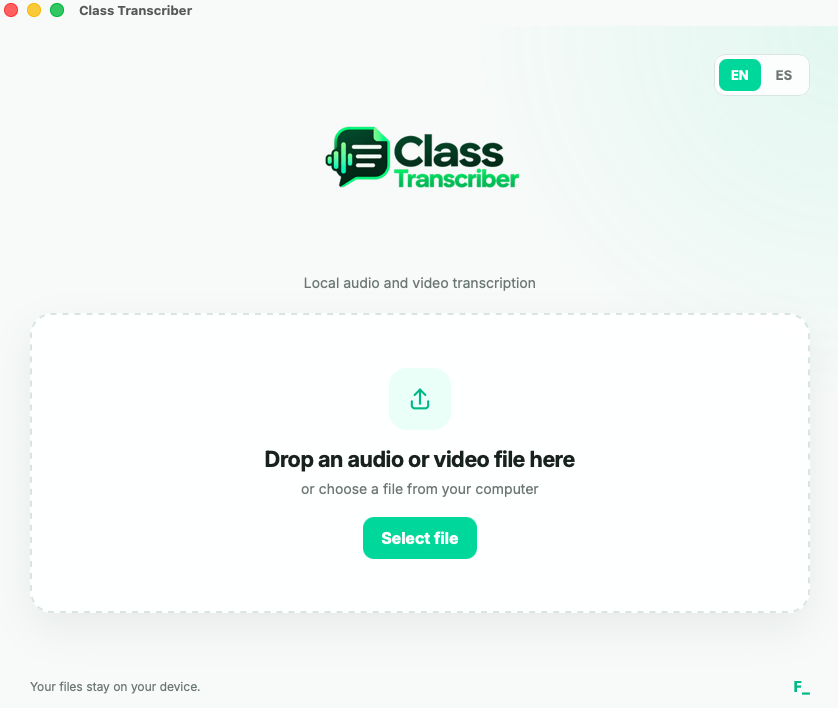

# Class Transcriber


A small open-source desktop app for transcribing audio and video files locally with [whisper.cpp](https://github.com/ggml-org/whisper.cpp).

No accounts. No cloud uploads. No subscriptions.



## ✨ Features

- Local transcription
- Audio and video support
- Drag & drop
- English and Spanish interface
- TXT output
- Files stay on your device
- Built with Tauri

## 🎧 Supported formats

Common formats include:

`MP4` `MOV` `M4V` `MKV` `WebM` `AVI`

`MP3` `WAV` `M4A` `AAC` `FLAC` `OGG`

## 🛠 Current requirements

The current development version requires:

- FFmpeg
- whisper.cpp
- A compatible Whisper GGML model

Current macOS development setup:

```text
/opt/homebrew/bin/ffmpeg
/opt/homebrew/bin/whisper-cli
~/whisper-models/ggml-medium.bin
```

A self-contained version is planned so users will not need to install these dependencies manually.

## 💻 Development

Requirements:

- Node.js
- Rust
- Tauri prerequisites

```bash
git clone https://github.com/fivur-cs/class-transcriber.git
cd class-transcriber
npm install
npm run tauri dev
```

## 🔒 Privacy

Class Transcriber processes media locally.

The application does not upload your audio, video, or transcripts to an external service.

## 🖥 Platforms

Currently tested on macOS.

Windows and Linux builds are planned.

## 📄 License

MIT
